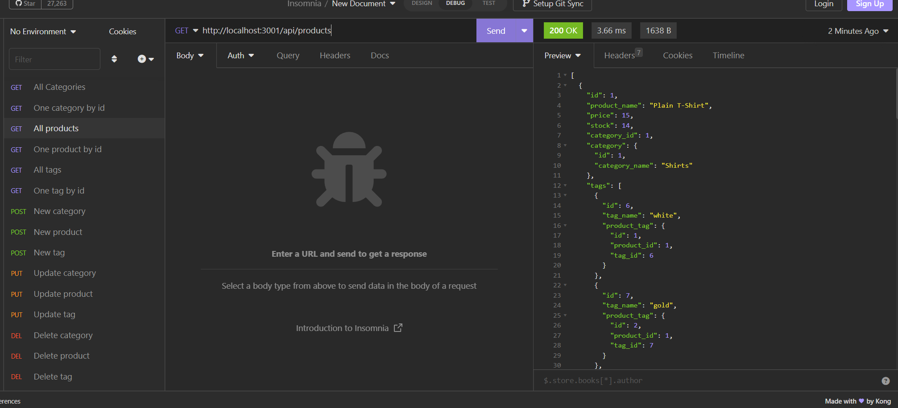

# E-commerce Back End

DU bootcamp challenge

### License

MIT

### Description

Backend structure for a e-commerce site using javascript.

### Usage

npm i to install 
npm start to start 
insomnia to view routes

### Links

https://drive.google.com/file/d/1w4FxdStWnvEFszwIVfZJZywpGa_Df4gs/view

### Credits

Much of the code for this was found in the unit's activities - almost verbatim. From my limited experience, it seems like basic back end structures like this are really just the same code repeated for different variables - it feels a little like cheating.
